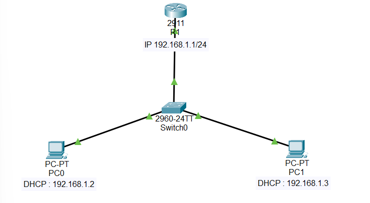

# Proyek Jaringan: Jaringan Sederhana DHCP & Ping Test

## Gambaran Umum Proyek
Proyek ini mendemonstrasikan pembangunan jaringan lokal sederhana menggunakan Cisco Packet Tracer. Tujuan utamanya adalah mengkonfigurasi sebuah router sebagai DHCP server untuk secara otomatis mendistribusikan alamat IP kepada host (PC), serta memverifikasi konektivitas end-to-end antar perangkat dalam jaringan.

## Teknologi & Konsep yang Digunakan
* **Software:** Cisco Packet Tracer
* **Perangkat Jaringan:** Cisco 2911 Router, Cisco 2960 Switch, PC
* **Konsep Jaringan:**
    * IP Addressing & Subnetting
    * Dynamic Host Configuration Protocol (DHCP)
    * Basic Routing (Directly Connected Routes)
    * Switching (Basic Layer 2 Forwarding)
    * Verifikasi Konektivitas (Ping)

## Topologi Jaringan
Berikut adalah diagram topologi jaringan yang dibangun dalam simulasi:



### Alokasi IP Address
| Perangkat | Interface   | IP Address       | Subnet Mask       | Gateway        | Catatan                     |
| :-------- | :---------- | :--------------- | :---------------- | :------------- | :-------------------------- |
| R1        | G0/0        | 192.168.1.1      | 255.255.255.0     | N/A            | Interface ke LAN, DHCP Server |
| PC1       | FastEthernet0 | (DHCP)           | (DHCP)            | 192.168.1.1    | Klien DHCP                  |
| PC2       | FastEthernet0 | (DHCP)           | (DHCP)            | 192.168.1.1    | Klien DHCP                  |

## Konfigurasi Router (R1)
Berikut adalah konfigurasi CLI yang diterapkan pada Router R1:

```cli
enable
configure terminal
hostname R1

interface GigabitEthernet0/0
 ip address 192.168.1.1 255.255.255.0
 no shutdown
exit

ip dhcp pool MY_NETWORK
 network 192.168.1.0 255.255.255.0
 default-router 192.168.1.1
 dns-server 8.8.8.8
exit

end
write memory#
